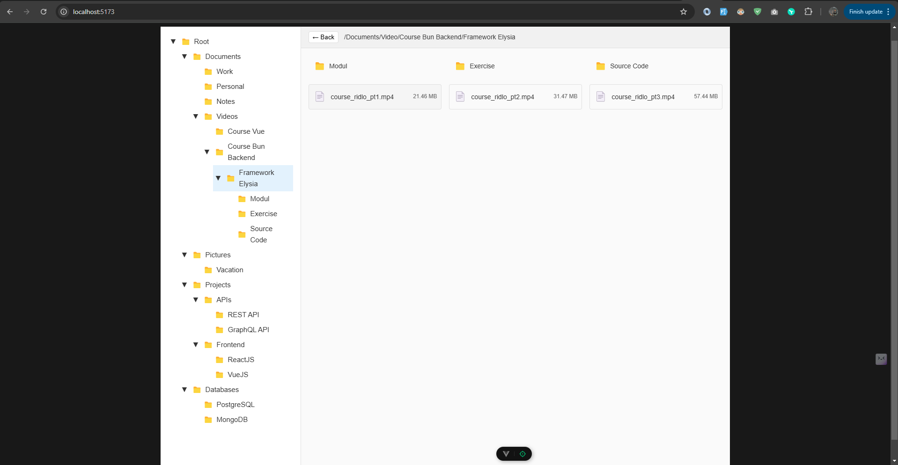

# File Explorer Web Application



## Table of Contents
- [Introduction](#introduction)
- [Features](#features)
- [Technology Stack](#technology-stack)
- [Project Architecture](#project-architecture)
- [Database Schema](#database-schema)
- [API Documentation](#api-documentation)
- [Project Structure](#project-structure)
- [Getting Started](#getting-started)
- [Development](#development)

## Introduction

This web application implements a dual-panel File Explorer interface, providing an intuitive way to navigate and manage folder structures. The application features a comprehensive folder tree view on the left panel and detailed content display on the right panel.

## Features

- **Dual Panel Interface**
  - Left Panel: Complete folder structure visualization
  - Right Panel: Dynamic content display of selected folder
- **Real-time Navigation**
- **Responsive Design**
- **Advanced Search Capabilities**
- **File Management** (Bonus Feature)

## Technology Stack

- **Frontend**: Vue 3 with TypeScript
- **Backend**: Node.js with TypeScript
- **Runtime**: Bun
- **Database**: SQL (PostgreSQL recommended)
- **Package Manager**: Bun

## Project Architecture

The project follows a clean architecture pattern, separating concerns into distinct layers for maximum maintainability and scalability.

## Database Schema

### Folders Table
```sql
CREATE TABLE folders (
    id SERIAL PRIMARY KEY,
    name VARCHAR(255) NOT NULL,
    parent_id INTEGER REFERENCES folders(id),
    path TEXT NOT NULL,
    created_at TIMESTAMP DEFAULT CURRENT_TIMESTAMP,
    updated_at TIMESTAMP DEFAULT CURRENT_TIMESTAMP
);
```

### Files Table
```sql
CREATE TABLE files (
    id SERIAL PRIMARY KEY,
    name VARCHAR(255) NOT NULL,
    folder_id INTEGER REFERENCES folders(id),
    size BIGINT,
    mime_type VARCHAR(100),
    created_at TIMESTAMP DEFAULT CURRENT_TIMESTAMP,
    updated_at TIMESTAMP DEFAULT CURRENT_TIMESTAMP
);
```

## API Documentation

### Endpoints

#### Get All Folders
```
GET /api/v1/folders
```
- Retrieves complete folder structure
- Supports pagination and search functionality
- Returns nested structure with children

#### Get Folder Content
```
GET /api/v1/folders/:id/content
```
- Retrieves direct children of specified folder
- Includes files

Parameters:
- `id`: Folder ID (required)

## Project Structure

### Backend Directory Structure
```
backend/
├── src/
│   ├── core/
│   │   ├── domain/
│   │   │   ├── entities/
│   │   │   └── interfaces/
│   │   ├── usecases/
│   │   └── repositories/
│   ├── infrastructure/
│   │   ├── database/
│   │   └── web/
│   ├── interfaces/
│   │   ├── controllers/
│   │   └── routes/
│   └── shared/
│       ├── types/
│       └── utils/
├── tests/
└── package.json
```

### Frontend Directory Structure
```
frontend/
├── src/
│   ├── assets/
│   ├── components/
│   │   ├── explorer/
│   │   │   ├── FolderTree.vue
│   │   │   ├── FolderContent.vue
│   │   │   └── FolderItem.vue
│   │   └── shared/
│   ├── stores/
│   ├── types/
│   ├── utils/
│   └── views/
├── tests/
└── package.json
```

## Getting Started

### Prerequisites

- Bun (latest version)
- Node.js (v18 or higher)
- PostgreSQL (v14 or higher)

### Installation

1. Clone the repository:
```bash
git clone https://github.com/ridloal/file-explorer
cd file-explorer
```

2. Install backend dependencies:
```bash
cd backend
bun install
```

3. Install frontend dependencies:
```bash
cd frontend
bun install
```

## Development

### Running the Backend
```bash
cd backend
bun dev
```

### Running the Frontend
```bash
cd frontend
bun dev
```

The application will be available at `http://localhost:3000` by default.
